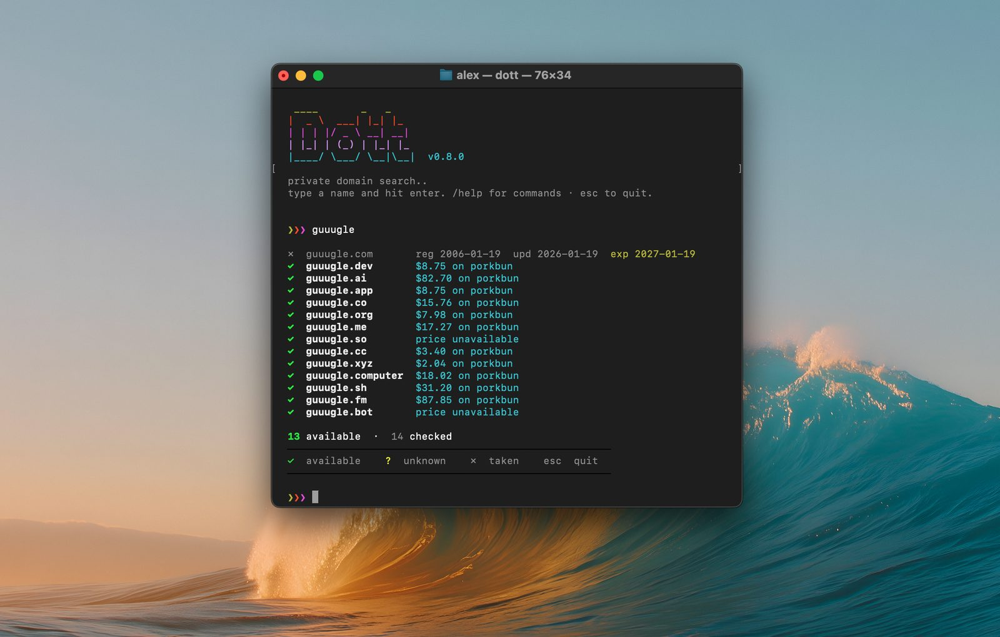

<h1 align="center">dott — domain availability checker for your terminal</h1>

<p align="center">
  <picture>
    <source srcset="preview.avif" type="image/avif">
    
  </picture>
</p>

Domain search for the terminal. Checks RDAP, WHOIS and DNS in parallel, straight against each registry.

## Install

```sh
curl -fsSL https://raw.githubusercontent.com/yodatosh/dott/master/install.sh | sh
```

Works on macOS and Linux (Intel and ARM); on Windows, run it inside WSL. Installs to `~/.local/bin`, or set `DOTT_INSTALL_DIR`.

## Update

`dott --update` (or `/update` in interactive mode) downloads, verifies and swaps in the new binary.

Homebrew was dropped in 0.8.0 to keep things simple: one binary, one installer, one update path. Installed with brew before? Run `brew uninstall dott && brew untap yodatosh/dott`, then the curl line above.

Terminal sessions check GitHub for a new release at most once a day; set `DOTT_NO_UPDATE_CHECK=1` to turn that off.

## Usage

```sh
dott                        # interactive mode
dott myname                 # check your chosen extensions (all by default)
dott myname.io              # check this exact domain
dott myname -t com,io,dev   # check these extensions, this run only
dott -s cool project        # suggest names from keywords
dott myname --plain         # one "<domain> <status>" per line, for scripts
echo myname | dott          # pipe mode (plain)
```

```text
  ✓  myname.com   $11.08 on porkbun
  ✓  myname.org   $7.98 on porkbun
  ★  myname.dev   reserved / blocked
  ?  myname.gg
  ✗  myname.io    reg 2019-05-02  exp 2026-08-15

  2 available  ·  5 checked
```

`✓` available · `✗` taken · `★` reserved · `?` unknown (inconclusive). Expiry dates turn orange under 90 days, yellow under a year.

Plain statuses are `available`, `taken`, `protected` and `unknown`; scripts and agents should treat only `available` as available. Invalid input exits nonzero with a message on stderr.

Interactive commands:

| Input               | What it does                            |
|---------------------|-----------------------------------------|
| `name` / `name.tld` | check your chosen extensions / one domain |
| `name+`, `+`        | suggest variants (of the last name)     |
| `/tlds`             | choose extensions (keyboard or mouse)   |
| `/watch <domain>`   | notify when a domain becomes free       |
| `/unwatch <domain>` | stop watching                           |
| `/list`             | show watchlist                          |
| `/update`, `/help`  | update dott, show commands              |

Your `/tlds` choice is saved in `~/.dott/extensions.json`. `--tlds` overrides it for one run, a full domain always checks just that domain, and plain/piped output ignores it.

## Prices

Available names show standard USD yearly estimates from [Porkbun's public catalog](https://porkbun.com/api/json/v3/pricing/get). Premium names and checkout totals may differ. Prices are refreshed at most once a day and saved in `~/.dott/prices.json`; plain output never includes them.

## Watchlist

```sh
dott --watch myname.com
dott --watching
dott --unwatch myname.com
```

On macOS a LaunchAgent re-checks the list daily at 9am and sends a notification from **dott** when a domain becomes available (dott keeps a tiny helper app at `~/.dott/dott.app` for this; allow it in System Settings → Notifications). Elsewhere, schedule `dott --background-check` yourself.

Changes (became available, was registered, now reserved) also show when you open dott. With zsh, `dott --shell-notice on` adds one marked line to `~/.zshrc` so every new terminal window shows them too; `dott --shell-notice off` removes it, and so does unwatching your last domain. Running `dott --watching` or opening dott marks them as seen.

## How it works

Each domain is checked against the registry's RDAP server, WHOIS (port 43) and Cloudflare DNS-over-HTTPS. Results merge with DNS > RDAP > WHOIS priority. Interactive mode pre-opens connections to the servers for your chosen extensions at startup (no domain names sent) so the first search is fast. "Available" means no registration was found — not a guarantee a registrar will sell it.

## Supported TLDs

com, net, org, io, dev, app, co, ai, me, so, gg, cc, cv, xyz, live, computer, sh, fm, fyi, work, bot

## License

[MIT](LICENSE)
